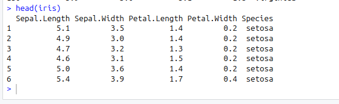
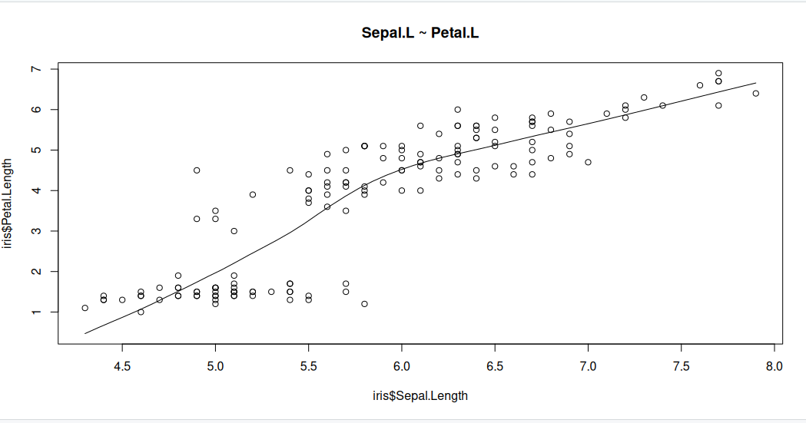
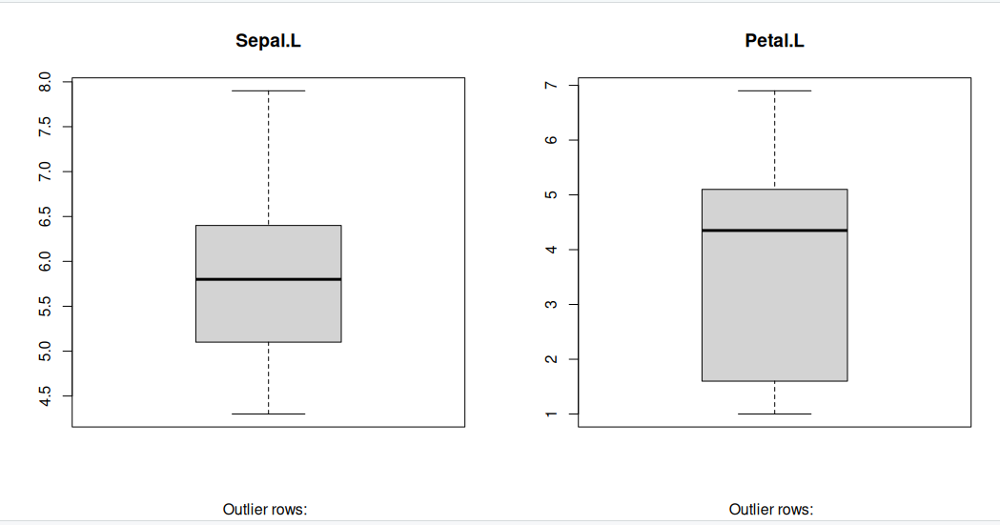
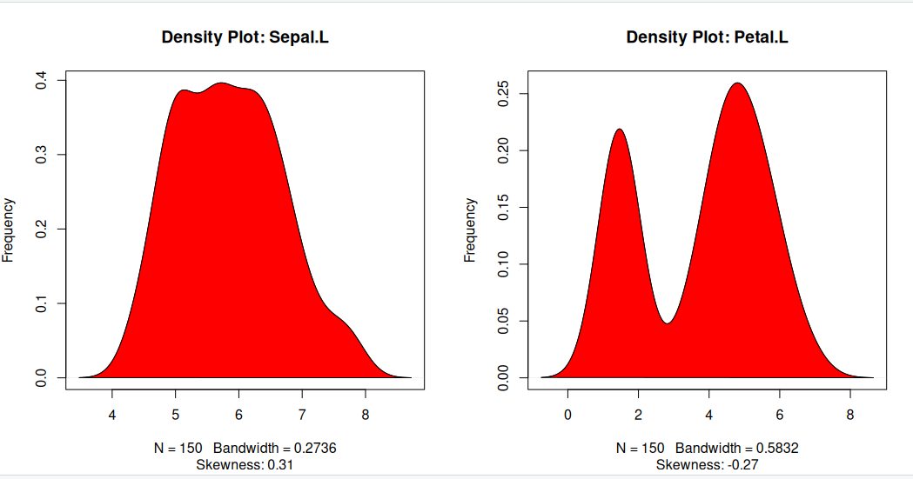
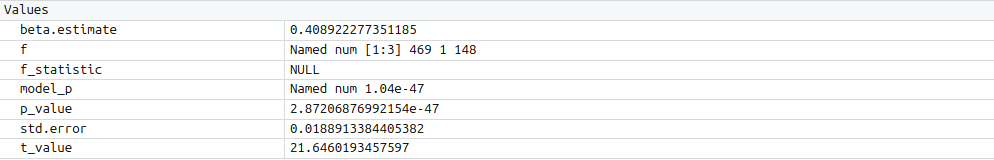
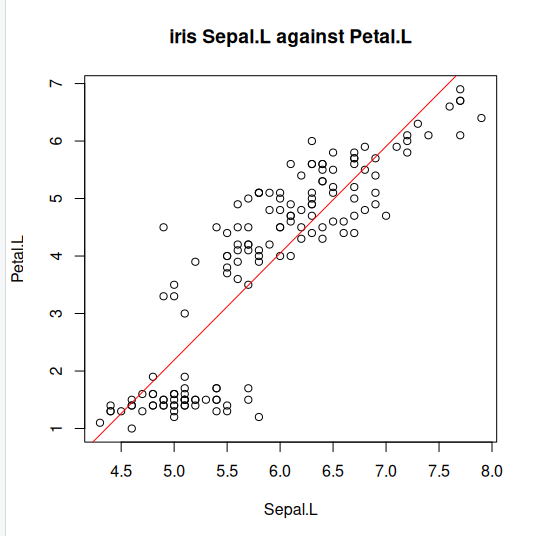

# What are Linear models

Linear models represent a continuous response variable as a function of one or more predictor variables. They are useful for understanding and predicting the behaviour of complex systems, as well as analysing experimental, financial, and biological data. 

In this course, we will briefly explore **Linear Regression**, a statistical method used to construct a linear model. This model defines the relationship between a dependent variable y (also known as the response) and one or more independent variables &chi;i (referred to as predictors). There our model takes the form of the following equation:

where &beta; represents linear parameter estimates to be computed and &epsilon; represents the error terms that is assumed to be normally distributed. 

## Key assumptions

- Response y is continuous

- Errors 𝜀 are: 
  * Normally distributed
  * Have constant variance (homoscedasticity)
  * Independent

- Relationship between predictors and response is linear

## Typical use cases

- Predicting:
  * Height
  * Temperature
  * Income
  * House prices
  
There are several types of linear regression:

* Simple linear regression: models using only one predictor
* Multiple linear regression: models using multiple predictors
* Multivariate linear regression: models for multiple response variables

For this course will refine our selves to a short introduction into simple regression, so lets have at how we would go about calculating a line of best fit with an example. 

## Linear models using the cars dataset

For this analysis, we will use the built-in cars dataset, which comes with R by default. This dataset is widely used for demonstrating linear regression in a straightforward and accessible way. You can access it by typing cars in your R console. The dataset contains 50 observations (rows) and 2 variables (columns): Petal.L and Petal.L. Let's print the dataset to see what it includes.

~~~
iris
head(iris)
~~~
{: .language-r}

>
{: .output}

Now before we move on to creating a simple linear regression model, its always go practise to analyse our dataset first such that we can fully understand the variables. Therefore lets conduct some graphical analysis. 

## Graphical analysis

The goal of this exercise is to build a simple regression model to predict Sepal.L by identifying a statistically significant linear relationship with Petal.L. Before diving into the syntax, let's first explore these variables graphically.

To better understand the behaviour of the predictor variable, we typically use the following visualisations:

* Scatter Plot: Helps visualise the linear relationship between the predictor and response variables.
* Box Plot: Identifies potential outliers in the predictor variable. Outliers can significantly impact predictions by influencing the slope and direction of the best-fit line.
* Density Plot: Shows the distribution of the predictor variable. Ideally, the distribution should be approximately normal (a bell-shaped curve) without significant skewness.

Now, let's create these plots to analyse the dataset.

### Scatter Plot

Scatter plots can help visualise any linear relationships between the dependent (response) variable and independent (predictor) variables. Ideally, if you are having multiple predictor variables, a scatter plot is drawn for each one of them against the response, along with the line of best as seen below.

~~~
scatter.smooth(x=iris$Sepal.Length, y=iris$Petal.Length, main="Sepal.L ~ Petal.L") # scatterplot
~~~
{: .language-r}

>
{: .output}

The scatter plot along with the smoothing line above suggests a linearly increasing relationship between the ‘Sepal.L’ and ‘Petal.L’ variables. This is a good thing, because, one of the underlying assumptions in linear regression is that the relationship between the response and predictor variables is linear and additive.

### Boxplot to check for outliers

Generally, any datapoint that lies outside the 1.5 * interquartile-range (1.5 * IQR) is considered an outlier, where, IQR is calculated as the distance between the 25th percentile and 75th percentile values for that variable.

~~~
par(mfrow=c(1, 2))  # divide graph area in 2 columns
boxplot(iris$Sepal.Length, main="Sepal.L", sub=paste("Outlier rows: ", boxplot.stats(iris$Sepal.Length)$out))  # box plot for 'Sepal.L'
boxplot(iris$Petal.Length, main="Petal.L", sub=paste("Outlier rows: ", boxplot.stats(iris$Petal.Length)$out))  # box plot for 'Petal.L'
~~~
{: .language-r}

>
{: .output}

### Density plot – Check if the response variable is close to normality

Its a good idea to check if our data takes the form of a normal distribution, to make choosing to use linear regression applicable.

~~~
install.packages("e1071")
library(e1071)
par(mfrow=c(1, 2))  # divide graph area in 2 columns
plot(density(iris$Sepal.Length), main="Density Plot: Sepal.L", ylab="Frequency", sub=paste("Skewness:", round(e1071::skewness(iris$Sepal.Length), 2)))  # density plot for 'Sepal.L'
polygon(density(iris$Sepal.Length), col="red")
plot(density(iris$Petal.Length), main="Density Plot: Petal.L", ylab="Frequency", sub=paste("Skewness:", round(e1071::skewness(iris$Petal.Length), 2)))  # density plot for 'Petal'
polygon(density(iris$Petal.Length), col="red")
~~~
{: .language-r}

>
{: .output}

### Correlation

Correlation is a statistical measure that indicates the degree of linear dependence between two paired variables, such as Petal.L and Sepal.L in our dataset. It ranges from -1 to +1:

* A correlation close to +1 suggests a strong positive relationship, meaning that as Sepal.L increases, Petal.L also tends to increase.
* A correlation close to -1 indicates a strong negative relationship, where an increase in Sepal.L corresponds to a decrease in Petal.L.
* A correlation near 0 implies a weak or no linear relationship between the variables.

If the correlation is low (between -0.2 and 0.2), it suggests that the predictor (X) explains little of the variation in the response variable (Y). In such cases, we may need to explore alternative explanatory variables for better predictions.

~~~
cor(iris$Sepal.Length, iris$Petal.Length)  # calculate correlation between Sepal.L and Petal.L 
~~~
{: .language-r}

~~~
[1] 0.8717538
~~~
{: .output}

## Building a linear model

Now that we've visualized the linear relationship using a scatter plot and confirmed it by calculating the correlation, let's move on to building the linear model.

In R, we use the lm() function to create linear models. This function requires two main arguments:

* Formula – Defines the relationship between the response and predictor variables.
* Data – A dataset (typically a data.frame) containing the variables.

Although the formula can be stored as an object of class formula, it is most commonly written directly within the function call, as shown in the example below.

~~~
linearMod <- lm(Sepal.Length ~ Petal.Length, data=iris)  # build linear regression model on full data
print(linearMod)

~~~
{: .language-r}

~~~
Call:
lm(formula = Sepal.Length ~ Petal.Length, data = iris)

Coefficients:
 (Intercept)  Petal.Length  
      4.3066        0.4089  
~~~
{: .output}

Now that we've built the linear model, we have defined the relationship between the predictor Petal.L and the response Sepal.L in the form of a mathematical equation.

From the model output, you’ll notice the Coefficients section, which consists of two components:

* Intercept: 4.3066
* Petal.Length: 0.4089  

These values are known as beta coefficients, and they define the equation for Sepal.L as a function of Petal.L:
Sepal.L = Intercept + (&beta; ∗ Petal.L)
Substituting the values:
=> Sepal.L = 4.3066 + 0.4089∗Petal.L

## Linear regression diagnostics

Now that we've built the linear model and derived a formula to predict Sepal.L based on a given Petal.L, can we immediately start using it? Not yet!

Before applying a regression model, we must first verify its statistical significance. But how do we do that?

A good starting point is to examine the summary statistics of our model. Let’s print the summary of linearMod to evaluate its significance and performance.

~~~
summary(linearMod)  # model summary

~~~
{: .language-r}

~~~
Call:
lm(formula = Sepal.Length ~ Petal.Length, data = iris)

Residuals:
     Min       1Q   Median       3Q      Max 
-1.24675 -0.29657 -0.01515  0.27676  1.00269 

Coefficients:
             Estimate Std. Error t value Pr(>|t|)    
(Intercept)   4.30660    0.07839   54.94   <2e-16 ***
Petal.Length  0.40892    0.01889   21.65   <2e-16 ***
---
Signif. codes:  0 ‘***’ 0.001 ‘**’ 0.01 ‘*’ 0.05 ‘.’ 0.1 ‘ ’ 1

Residual standard error: 0.4071 on 148 degrees of freedom
Multiple R-squared:   0.76,	Adjusted R-squared:  0.7583 
F-statistic: 468.6 on 1 and 148 DF,  p-value: < 2.2e-16
~~~
{: .output}

* Model formula: A quick reminder of the model formula that was fit.

* Residuals: Residuals are very important as they represent the distance that each observation is from the fitted model. Obviously, we want the fitted model that best describes the data, but there will be some residual error no matter what. What is most important with residuals is that they are normally distributed around 0. If they are not centered around 0, it means the model is over or under predicting too many points. And if the residuals are not normal (i.e., symmetric), it also means something is not being fit well. We don’t need a mean exactly at 0 and perfect symmetry, but we do want to avoid major deviations relative to the data. We want a median residual around 0, and the Min and Max to be relatively the same.

* Coefficients: These are simply the parameter estimates. In the model above, the intercept i estimated to be 2.494 and the slope of x is estimated to be 1.299. They will be accompanied by a standard error (Std. Error), which is a measure of uncertainty around the estimate. Finally, the t value is the test statistics that feeds directly into the p-value:

|t|))" />

  The p-value is likely what you will look at first, but please recall that a p-value is only as good as the model is for the data; in other words, a significant p-value is    meaningless or even dangerous if the model is a poor fit for the data.

* Significance codes: I suggest to avoid these at all cost. If you want to play by the rules of p-values, then a priori select a significance threshold and that is the only significance threshold that should mean anything. Most people select 0.05.

* Residual standard error: This is the standard deviation (spread) of residuals. You may find it useful, but it is not often reported.

* Multiple R-squared: % of variance explained by model. Personally, I am not a big user of R2
values or their variants. The reasons behind this get into a longer discussion that we won’t have, but in general I think there more more effective ways to report on a model. Nevertheless, R2 is a common model metric and some people will want to know it. Just be reminded that while a higher R2 is “better”, R2 always increases with additional model terms

* Adjusted R-squared: % of variance explained by model adjusted for more model terms that may not be that explanatory. Basically, this metric is like R2, but not as liberal as the regular R2. The formula for the adjusted R2 is: 

* F-statistic: The F-statistic is another test statistic, but one for the model (compared the t statistics which were for individual coefficients). F-statistic tests the null hypothesis that all model coefficients = 0 (ratio of two variances: variance explained by parameters and residual, unexplained variance). You will not typically report an F-statistic in a linear regression model, but you will for an ANOVA.

## The p Value: Checking for statistical significance

The summary statistics provide valuable insights into our model's reliability. Two key aspects to examine are:

* The model’s overall p-value (found in the last line of the output).
* The p-values of individual predictor variables (located in the rightmost column under "Coefficients").

### Understanding p-values

P-values are crucial because a  linear model is considered statistically significant only if both the model’s p-value and the predictor’s p-value are less than 0.05 (the standard significance level). This is visually represented by significance stars next to each variable—more stars indicate higher significance.

###Null and Alternative Hypotheses

Every p-value corresponds to a hypothesis test:

* Null Hypothesis (H₀): The coefficient of the predictor is zero, meaning no relationship exists between the independent and dependent variable.
* Alternative Hypothesis (H₁): The coefficient is not zero, indicating a significant relationship.

### Interpreting the t-value

The t-value measures how strongly a predictor variable influences the response variable:

* A larger t-value suggests a lower probability that the coefficient is zero by chance, meaning the predictor is more significant.
* The p-value:
|t|))" />
tells us the probability of obtaining such a high t-value under the null hypothesis. A low p-value (< 0.05) means the coefficient is significantly different from zero.

### What This Means for Our Model

In our case, both the model’s and the predictor’s p-values in linearMod are well below 0.05. This allows us to reject the null hypothesis and conclude that the predictor Petal.L has a statistically significant relationship with Sepal.L.

Ensuring statistical significance is critical before using a model for predictions—without it, our predictions may lack reliability and could simply be due to chance.

## How to calculate the t Statistic and p-Values?

When the model co-efficients and standard error are known, the formula for calculating t Statistic and p-Value is as follows: 

~~~
modelSummary <- summary(linearMod)  # capture model summary as an object
modelCoeffs <- modelSummary$coefficients  # model coefficients
beta.estimate <- modelCoeffs["Petal.Length", "Estimate"]  # get beta estimate for Petal.L
std.error <- modelCoeffs["Petal.Length", "Std. Error"]  # get std.error for Petal.L
t_value <- beta.estimate/std.error  # calc t statistic
p_value <- 2*pt(-abs(t_value), df=nrow(iris)-ncol(iris))  # calc p Value
f_statistic <- linearMod$fstatistic[1]  # fstatistic
f <- summary(linearMod)$fstatistic  # parameters for model p-value calc
model_p <- pf(f[1], f[2], f[3], lower=FALSE)

~~~
{: .language-r}

>
{: .output}

## AIC and BIC

The Akaike’s information criterion - AIC (Akaike, 1974) and the Bayesian information criterion - BIC (Schwarz, 1978) are measures of the goodness of fit of an estimated statistical model and can also be used for model selection. Both criteria depend on the maximized value of the likelihood function L for the estimated model.

The AIC is defined as:

AIC = (−2) × ln(L) + (2×k)

where, k is the number of model parameters and the BIC is defined as:

BIC = (−2) × ln(L) + k × ln(n)

where, n is the sample size.

For model comparison, the model with the lowest AIC and BIC score is preferred.

~~~
AIC(linearMod)  # AIC
BIC(linearMod)  # BIC

~~~
{: .language-r}

~~~
[1] 160.0404
[[1] 169.0723
~~~
{: .output}

## Predicting Linear Models

Up to this point, we've built a linear regression model using the entire dataset. However, this approach doesn’t allow us to assess how well the model will perform on new data.

A better practice is to split the dataset into training (80%) and test (20%) subsets. The model is trained on the 80% sample, and then its performance is evaluated by predicting the dependent variable on the test data.

By doing this, we obtain both:

* Predicted values for the test data.
* Actual values from the original dataset.

We can then measure the model’s accuracy using metrics like Min-Max Accuracy and error rates such as MAPE (Mean Absolute Percentage Error) or MSE (Mean Squared Error). These help determine how well the model generalises to new data.

Now, let's walk through the process of implementing this approach.
### Step 1: Create the training (development) and test (validation) data samples from original data.

~~~
# Create Training and Test data -
set.seed(100)  # setting seed to reproduce results of random sampling
trainingRowIndex <- sample(1:nrow(iris), 0.8*nrow(iris))  # row indices for training data
trainingData <- iris[trainingRowIndex, ]  # model training data
testData  <- iris[-trainingRowIndex, ]   # test data

~~~
{: .language-r}

### Step 2: Develop the model on the training data and use it to predict the Sepal.L on test data

~~~
# Build the model on training data -
lmMod <- lm(Sepal.Length ~ Petal.Length, data=trainingData)  # build the model
SepalPred <- predict(lmMod, testData)  # predict Sepal.L

~~~
{: .language-r}

### Step 3: Review diagnostic measures.

~~~
summary (lmMod)  # model summary
AIC (lmMod)

~~~
{: .language-r}

~~~

Call:
lm(formula = Sepal.Length ~ Petal.Length, data = trainingData)

Residuals:
     Min       1Q   Median       3Q      Max 
-1.22492 -0.29158 -0.03953  0.26644  1.03312 

Coefficients:
             Estimate Std. Error t value Pr(>|t|)    
(Intercept)   4.27305    0.09128   46.81   <2e-16 ***
Petal.Length  0.41153    0.02216   18.57   <2e-16 ***
---
Signif. codes:  0 ‘***’ 0.001 ‘**’ 0.01 ‘*’ 0.05 ‘.’ 0.1 ‘ ’ 1

Residual standard error: 0.4185 on 118 degrees of freedom
Multiple R-squared:  0.7451,	Adjusted R-squared:  0.7429 
F-statistic: 344.9 on 1 and 118 DF,  p-value: < 2.2e-16

[1] 135.477
~~~
{: .output}

From the model summary, the model p value and predictor’s p value are less than the significance level, so we know we have a statistically significant model. Also, the R-Sq and Adj R-Sq are comparative to the original model built on full data.

### Step 4: Lets explore what our line of best fit looks like

~~~
plot(iris$Sepal.Length, iris$Petal.Length, pch=21, main="iris Sepal.L against Petal.L", xlab="Sepal.L", ylab="Petal.L")
abline(lm(Petal.Length ~ Sepal.Length, data=iris)$coefficients, col="red")
~~~
{: .language-r}

>
{: .output}


