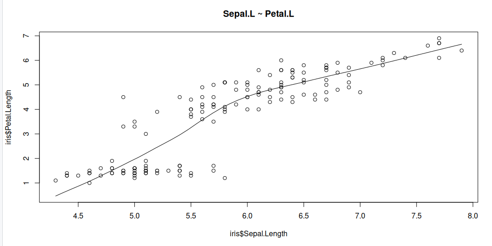
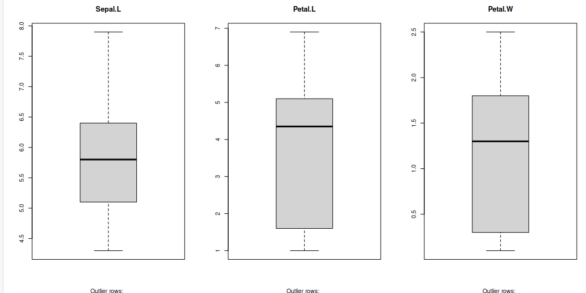
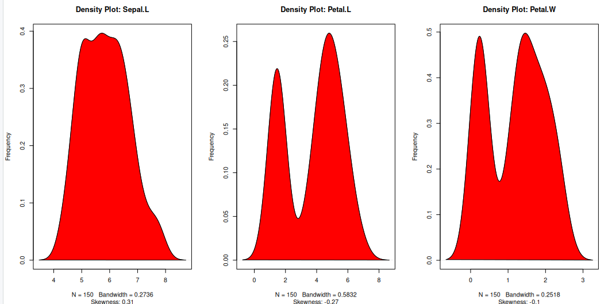
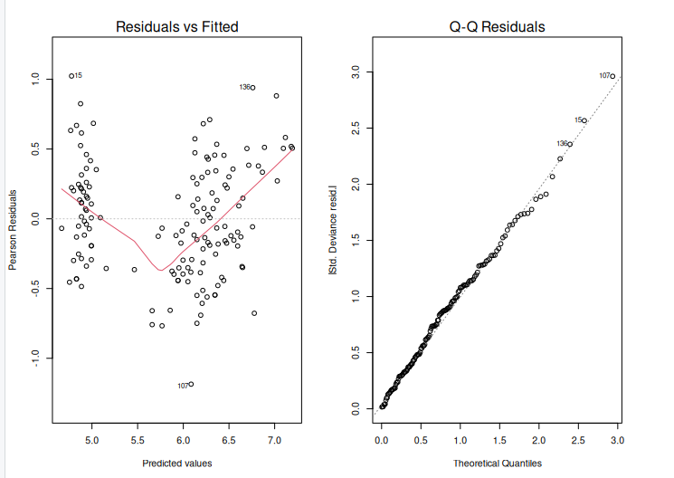

# what are GLMs

Generalised Linear Models are a broad class of statistical models used to describe relationships between a dependent variable and one or more independent variables. They extend ordinary linear regression by allowing for different types of dependent variables and error structures.

## What are Generalised linear models

A Generalised Linear Model (GLMs) extends ordinary linear regression by allowing response variables to follow error distributions other than the normal (Gaussian) distribution which is a General linear model. Essentially, a GLM is a linear model with a modified error distribution that more accurately represents the data-generating process and has found common use for analysing data examples such as count data or binary. For example, if your response variable consists of binary outcomes, such as successes and failures coded as 1s and 0s, these values do not follow a normal distribution, nor would their residuals exhibit a normal error distribution. In such cases, adjusting the underlying distribution in the model ensures a better fit for the data.

We now create a basic linear model for a given dataset. It would be valuable to assess the accuracy of this model. One way to achieve this is by computing the predicted y-values for each x-value in our original dataset and comparing them with the actual y-values. We can aggregate these individual discrepancies into a single comprehensive error metric by calculating the least squares. This involves squaring each difference, summing them all, dividing the sum by the total number of observations, and then taking the square root of the result. By squaring and subsequently taking the square root, we prevent negative errors from offsetting positive ones, thus providing us with an overall error metric to gauge the accuracy of our model.

linear regression, logistic regression, and Poisson regression are really all special examples of a more general method, something called a "generalized linear model". The great thing about "generalized linear models" is that they allow us to use "response" data that can take any value (like how big an organism is in linear regression), take only 1's or 0's (like whether or not someone has a disease in logistic regression), or take discrete counts (like number of events in Poisson regression).

## Summary: What they are ?

* Extend linear models to handle non-normal response variables.
* Useful when the response is binary, count, or proportion data.

## Three components of a GLM

- Random component
  * Distribution of the response (from the exponential family)
  * e.g. Normal, Binomial, Poisson

- Systematic component
  * Linear predictor:

- Link function
  * Connects the mean of y to the linear predictor:
  

Typical use cases

* Binary outcomes → Logistic regression
* Counts → Poisson regression
* Proportions → Binomial regression

>
{: .output}

>
{: .output}

## GLM using iris dataset

We will use the “iris” dataset in R to illustrate the use of GLM. This dataset includes data on different car models, including Sepal.L, Petal.L, and Petal.W. The response variable will be “Sepal.L,” and the predictor factors will be “Petal.L” and “Petal.W”

~~~
iris
head(iris)
~~~
{: .language-r}

Now as we did before with the linear version, its a good idea to analyses our dataset first so lets visualise our data. But the issue this time is that we are considering two variables hp and wt that we should look at seperately.

## Graphical analysis

### Scatter Plot

Scatter plots can help visualise any linear relationships between the dependent (response) variable and independent (predictor) variables. Ideally, if you are having multiple predictor variables, a scatter plot is drawn for each one of them against the response, along with the line of best as seen below.

~~~
scatter.smooth(x=iris$Sepal.Length, y=iris$Petal.Length, main="Sepal.L ~ Petal.L")
~~~
{: .language-r}

>
{: .output}
~~~
scatter.smooth(x=iris$Sepal.Length, y=iris$Petal.Width, main="Sepal.L ~ Petal.W")
> 
~~~
{: .language-r}

>
{: .output}

### Boxplot to check for outliers

Generally, any datapoint that lies outside the 1.5 * interquartile-range (1.5 * IQR) is considered an outlier, where, IQR is calculated as the distance between the 25th percentile and 75th percentile values for that variable.

~~~
par(mfrow=c(1, 3))  # divide graph area in 2 columns
boxplot(iris$Sepal.Length, main="Sepal.L", sub=paste("Outlier rows: ", boxplot.stats(iris$Sepal.Length)$out))  # box plot for 'Sepal.L'
boxplot(iris$Petal.Length, main="Petal.L", sub=paste("Outlier rows: ", boxplot.stats(iris$Petal.Length)$out))  # box plot for 'Petal.L'
boxplot(iris$Petal.Width, main="Petal.W", sub=paste("Outlier rows: ", boxplot.stats(iris$Petal.Width)$out))  # box plot for 'Petal.W'
~~~
{: .language-r}

>
{: .output}

### Density plot – Check if the response variable is close to normality

Its a good idea to check what form our data is in, to make choosing to use GLM applicable.

~~~
library(e1071)
par(mfrow=c(1, 3))  # divide graph area in 2 columns
plot(density(iris$Sepal.Length), main="Density Plot: Sepal.L", ylab="Frequency", sub=paste("Skewness:", round(e1071::skewness(iris$Sepal.Length), 2)))  # density plot for 'Sepal.L'
polygon(density(iris$Sepal.Length), col="red")
plot(density(iris$Petal.Length), main="Density Plot: Petal.L", ylab="Frequency", sub=paste("Skewness:", round(e1071::skewness(iris$Petal.Length), 2)))  # density plot for 'wt'
polygon(density(iris$Petal.Length), col="red")
plot(density(iris$Petal.Width), main="Density Plot: Petal.W", ylab="Frequency", sub=paste("Skewness:", round(e1071::skewness(iris$Petal.Width), 2)))  # density plot for 'wt'
polygon(density(iris$Petal.Width), col="red")
~~~
{: .language-r}

>
{: .output}

## Building the model

The Gaussian family is used in this example, which implies that the response variable has a normal distribution. The glm() function yields an object of class “glm” containing model information such as coefficients and deviance.

~~~
model <- glm(Sepal.Length ~ Petal.Length + Petal.Width, data = iris, family = gaussian)
~~~
{: .language-r}

### Why Gaussian family?

The model may be clearly understood in terms of the mean and variance of the response variable, which is one benefit of employing the Gaussian family. Additionally, the model can be fitted using the well-known and popular statistical technique known as maximum likelihood estimation.

~~~
summary(model)
~~~
{: .language-r}

~~~
Call:
glm(formula = Sepal.Length ~ Petal.Length + Petal.Width, family = gaussian, 
    data = iris)

Coefficients:
             Estimate Std. Error t value Pr(>|t|)    
(Intercept)   4.19058    0.09705  43.181  < 2e-16 ***
Petal.Length  0.54178    0.06928   7.820 9.41e-13 ***
Petal.Width  -0.31955    0.16045  -1.992   0.0483 *  
---
Signif. codes:  0 ‘***’ 0.001 ‘**’ 0.01 ‘*’ 0.05 ‘.’ 0.1 ‘ ’ 1

(Dispersion parameter for gaussian family taken to be 0.1624537)

    Null deviance: 102.168  on 149  degrees of freedom
Residual deviance:  23.881  on 147  degrees of freedom
AIC: 158.05

Number of Fisher Scoring iterations: 2
~~~
{: .output}

A one-unit Petal.L increase predicts a 0.54178 Sepal increase, while Petal.W increase predicts a 0.31955 Sepal.L decrease. Significance: All coefficients (intercept, hp, wt) are statistically significant, ensuring reliability. 

* Fit: Low residual deviance (23.881) versus null deviance (102.168) and AIC (158.05) indicate a well-fitting model. 
* Dispersion (0.1624537) measures Sepal.L variability, essential for assessing prediction precision. 

## Visualise the model

~~~
plot(model, which = 1) # Plot the residual vs fitted values
plot(model, which = 2) # Plot the Q-Q plot of residuals
~~~
{: .language-r}

>
{: .output}

After creating an extended linear model, we must evaluate its fit to the data. This can be accomplished with the help of diagnostic graphs such as the residual plot and the Q-Q plot. The output is shown above.

The residual plot displays the residuals (differences between measured and predicted values) plotted against the fitted values. (i.e. the predicted values). We want to see a random scatter of residuals around zero, which indicates that the model is capturing the data trends.
The residuals Q-Q plot displays the residuals plotted against the anticipated values if they were normally distributed. The points should follow a straight line, showing that the residuals are normally distributed.

## Using ANOVA to compare two models

We will fit two glm models to the data:

* A simple model with fewer predictors.
* A complex model with more predictors.

We can now use the anova() function to compare the two models using a likelihood ratio test. 
~~~
simple_model <- glm(Sepal.Length ~ Petal.Length, data = iris, family = gaussian)
complex_model <- glm(Sepal.Length ~ Petal.Length + Petal.Width, data = iris, family = gaussian)
model_comparison <-anova(simple_model, complex_model, test="Chisq")
~~~
{: .language-r}

~~~
Model 1: Sepal.Length ~ Petal.Length
Model 2: Sepal.Length ~ Petal.Length + Petal.Width
  Resid. Df Resid. Dev Df Deviance Pr(>Chi)  
1       148     24.525                       
2       147     23.881  1  0.64434  0.04642 *
---
Signif. codes:  0 ‘***’ 0.001 ‘**’ 0.01 ‘*’ 0.05 ‘.’ 0.1 ‘ ’ 1
~~~
{: .output}

The anova() function performs the test, and the argument test = "Chisq" specifies that a chi-squared test should be used. The result will include the degrees of freedom (Df), deviance, and the p-value of the test.

~~~
p_value <- model_comparison$`Pr(>Chi)`[2]   # Second row for comparison between models
print(p_value)
~~~
{: .language-r}

~~~
[1] 0.04641967
~~~
{: .output}

Here, the Pr(>Chi) column holds the p-values, and we select the second row ([2]), which corresponds to the comparison between the two models. The resulting p_value will give the significance of adding the additional predictor(s) in the complex model.

* High p-value (p > 0.05): The simpler model is sufficient. There is no evidence that the complex model is a better fit.
* Low p-value (p < 0.05): The complex model provides a significantly better fit, and the additional predictor(s) improve the model.

For example, if the p-value is 0.03, this would indicate that the more complex model is significantly better than the simpler model at the 5% significance level.

## Generalised linear models possible error distributions

### Poisson linear regression

Recall the Poisson distribution is a distribution of values that are zero or greater and integers only. The classic example of Poisson data are count observations–counts cannot be negative and typically are whole numbers. The Poisson distribution has one parameter, $(lambda), which is both the mean and the variance. A Poisson regression uses Log link (and therefore the coefficients need to be exponentiated to return them to the natural scale).

~~~
glm(y ~ x, family = poisson)
~~~
{: .language-r}

### Binomial linear regression

Binomial regression is for binomial data—data that have some number of successes or failures from some number of trials. Let’s focus on the most common application of the binomial regression which is that when the number of trials is 1, which is often called logistic regression. The application of this model is when we have 1s and 0s as our outcomes, which often represent successes or failures, presence or absence, or any other binary outcome. The coefficients of a logistic regression model are reported in log-odds (the logarithm of the odds), which can be converted back to probability scale with the plogis() function. It is also worth noting that the estimate of p(50), or the probability of 50% for y, is calculated simply by taking the fraction of the negative intercept over the slope value.

~~~
glm(y ~ x, family = binomial) 
~~~
{: .language-r}

##Example of binomial

~~~
iris$setosa <- ifelse(iris$Species == "setosa", 1, 0)

library(caTools)

set.seed(1)
split = sample.split(iris$Sepal.Length, SplitRatio = 0.75) ## create dataset split
train = subset(iris, split==TRUE) ## train split
test = subset(iris, split==FALSE) ## test split
y<-train$Species; x<-train$Sepal.Length ## use sepal length as features
glfit<-glm(y~x, family = 'binomial')
summary(glfit)

newdata <- data.frame(x=test$Sepal.Length) ## convert data into dataframe
predicted_val <-predict(glfit, newdata, type="response") ## predict test set
prediction <-data.frame(test$Sepal.Length, test$Species,predicted_val) ## cast prediction to dataframe
prediction
~~~
{: .language-r}

~~~
   test.Sepal.Length test.setosa predicted_val
1                4.6           1  0.9893396059
2                5.4           1  0.5193846862
3                4.6           1  0.9893396059
4                5.1           1  0.8516276448
5                5.1           1  0.8516276448
6                5.4           1  0.5193846862
7                5.2           1  0.7668856840
8                4.9           1  0.9458668740
9                5.5           1  0.3824793248
10               5.0           1  0.9092110734
11               4.4           1  0.9964728560
12               4.8           1  0.9682399616
13               6.4           0  0.0041167002
14               5.0           0  0.9092110734
15               5.8           0  0.1044354907

~~~
{: .output}


